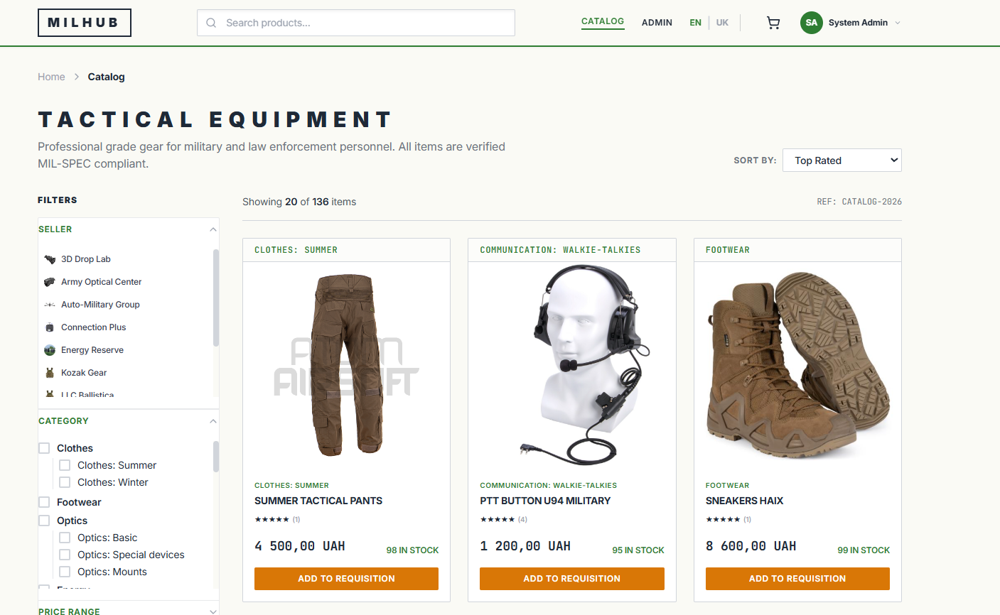
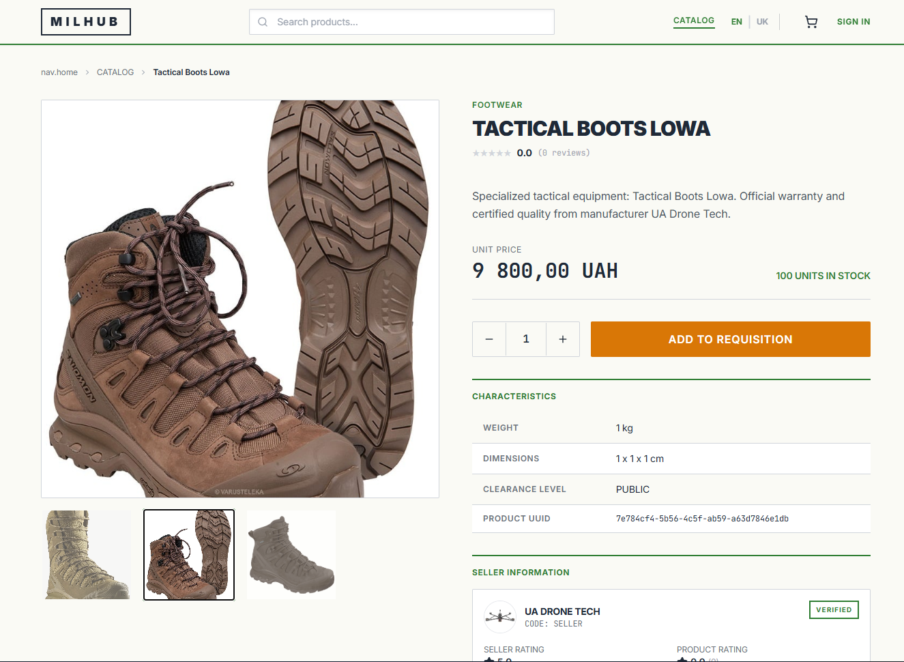
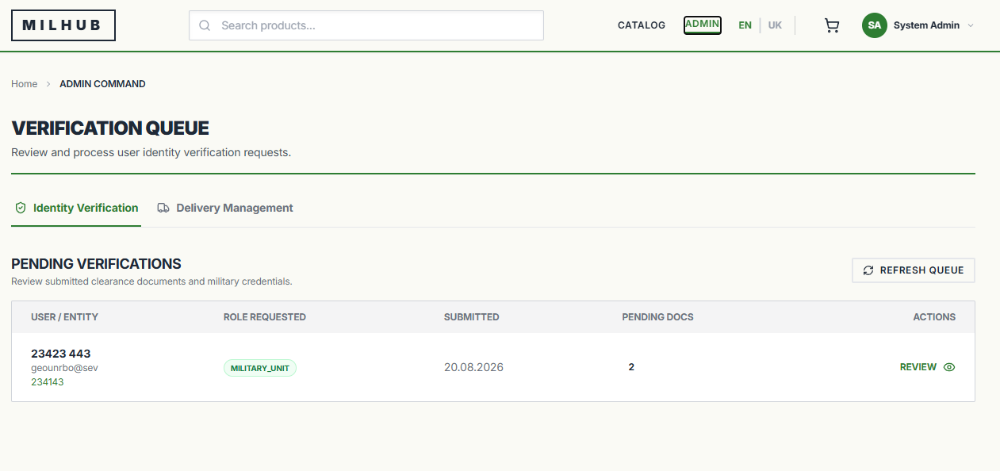
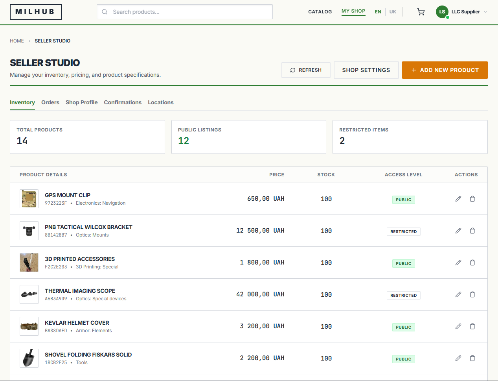

# 🛡️ MilHub Web Platform

[](https://milhub-frontend.vercel.app)
[](https://react.dev/)
[](https://vitejs.dev/)
[](https://www.typescriptlang.org/)
[](https://tailwindcss.com/)
[](https://www.framer.com/motion/)
[](https://vitest.dev/)

* **Live Web Application (Vercel)**: [https://milhub-frontend.vercel.app](https://milhub-frontend.vercel.app)
* **Production API Gateway (Backend)**: [https://milhub-api-gateway-258044247462.us-central1.run.app](https://milhub-api-gateway-258044247462.us-central1.run.app)
* **Backend Microservices Repository**: [https://github.com/rostikdiv/milhub-microservices.git](https://github.com/rostikdiv/milhub-microservices.git)

---

## 📖 Overview

**MilHub Web Platform** is a mission-critical Single Page Application (SPA) designed for defense logistics, military equipment procurement, and tactical gear requisitions. 

Built with React 18, Vite, TypeScript, and TailwindCSS, the application provides an ultra-fast, modern interface equipped with military clearance verification flows, role-based access control, real-time inventory management, and combat-tested equipment reviews.

---

## 📸 Interface Showcase (UI / UX)

| 🎯 Tactical Catalog & Defense Hardware | 📝 Combat-Tested Field Reports & Reviews |
| :---: | :---: |
|  |  |
| *Public vs restricted defense hardware with real-time stock levels* | *Combat-verified equipment reviews and tactical performance ratings* |

| ⚖️ Admin Moderation Command Center | 🚚 Delivery & Logistics Management |
| :---: | :---: |
|  |  |
| *Real-time queue for military ID & seller KYC document approval* | *Vendor order tracking, shipment dispatch, and logistics control* |

---

## ✨ Key Features

- 🎖️ **Military Clearance & Verification**: Specialized workflow for armed forces units and officers to upload verification documents (military IDs, official requisitions) with status tracking and high-visibility re-login alerts upon approval.
- 🛡️ **Restricted Equipment Access Control**: Visual `RESTRICTED` badges with automated checkout locking for unverified users and instantaneous unlocking for verified military units.
- 🏬 **Tactical Hardware Catalog**: Fast search, category filtering (Drones & UAVs, Thermal Optics, Body Armor, Tactical Comms), and live stock level indicators.
- 🏪 **Seller Studio**: Comprehensive workspace for defense equipment manufacturers and suppliers to manage inventory, configure clearance discounts, fulfill orders, and resolve return requests.
- ⚖️ **Admin Command Center**: Real-time moderation queue for reviewing uploaded military certificates and vendor KYC credentials with document preview and rejection reason dispatch.
- 📝 **Field Reports & Verified Purchase Reviews**: Equipment combat feedback system with `Verified Purchase` badges, star ratings, and dynamic average score recalculations.
- 🔄 **Real-Time Data Refresh Buttons**: Interactive reload buttons across Orders, Verification, and Seller dashboards for instantaneous data synchronization without page reloading.
- 🌐 **Bilingual Interface (EN / UK)**: Native support for English and Ukrainian languages across all views, forms, and alerts.

---

## 🏗️ Tech Stack

- **Core Framework**: React 18, TypeScript, Vite
- **Routing**: React Router DOM v6
- **Styling & UI**: TailwindCSS, Framer Motion, Lucide Icons, Glassmorphism design system
- **State & Notifications**: Context API (Auth, Cart, Language), `react-hot-toast`
- **HTTP Client**: Axios (with centralized JWT request & response interceptors)
- **Testing**: Vitest, React Testing Library, Mock Service Worker (MSW)
- **Hosting & CI/CD**: Vercel automated deployments with edge routing

---

## 🚀 Getting Started (Local Development)

### 1. Prerequisites
- Node.js 18+ strictly required
- npm 9+

### 2. Clone and Install Dependencies
```bash
git clone https://github.com/rostikdiv/milhub-frontend.git
cd milhub-frontend
npm install
```

### 3. Environment Variables
Create a `.env` file in the root directory:
```env
VITE_API_URL=/api/v1
```

### 4. Start Development Server
```bash
npm run dev
```
The application will launch on `http://localhost:5173`.

---

## 🌐 API Proxy & Routing

During local development, Vite proxies all `/api/v1/*` requests to the local backend API Gateway running at `http://localhost:8080` (or the configured Cloud Run Gateway in production).

---

## 🧪 Testing & Code Quality

```bash
# Run unit & component tests (CI mode)
npm run test

# Run tests in watch mode
npm run test:watch

# Code linting
npm run lint
```

---

## 📦 Production Build

```bash
# Compile and build production bundle
npm run build

# Preview production build locally
npm run preview
```

---

## 📄 License

This project is licensed under the MIT License - see the [LICENSE](LICENSE) file for details.
